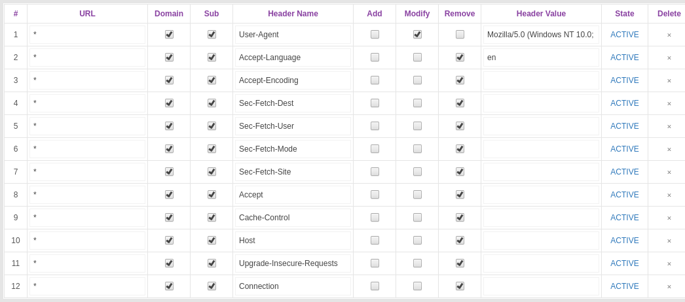

# dotfiles extended
Configs that i apparently forget in new environmets

That configs intended to make OS\Apps works **Smooth** and **Fast**.
At this time there many broken configurations and this should be used with care
and as a testing ground. Btw some of them i use on everyday manner.


# chromium

Configs
-------
`home/.config/chromium-flags.conf`

`/etc/chromium/policies/managed/unshit.json`

Plugins, updatethis (old)
-------

1.  [Canvas Blocker - Fingerprint
    Protect](https://chrome.google.com/webstore/detail/nomnklagbgmgghhjidfhnoelnjfndfpd "Prevent HTML canvas element from generating a unique identification key to protect user's privacy")
2.  [ClearURLs](https://chrome.google.com/webstore/detail/lckanjgmijmafbedllaakclkaicjfmnk "Remove tracking elements from URLs.")
3.  [Cookie
    AutoDelete](https://chrome.google.com/webstore/detail/fhcgjolkccmbidfldomjliifgaodjagh "Control your cookies! Automatically delete unwanted cookies from your closed tabs while keeping the ones you want.")
4.  [Export links of all
    extensions](https://chrome.google.com/webstore/detail/cmeckkgeamghjhkepejgjockldoblhcb "Export name and url of all installed extensions in Google Chrome")
5.  [LocalCDN](https://chrome.google.com/webstore/detail/njdfdhgcmkocbgbhcioffdbicglldapd "Protects you against tracking through CDNs (Content Delivery Networks) by redirecting to local resources.")
6.  -
7.  [Modify Header Value (HTTP
    Headers)](https://chrome.google.com/webstore/detail/cbdibdfhahmknbkkojljfncpnhmacdek "Add, modify or remove a header for any request on desired domains.")
8.  [NoScript](https://chrome.google.com/webstore/detail/doojmbjmlfjjnbmnoijecmcbfeoakpjm "Maximum protection for your browser: NoScript allows active content only for trusted domains of your choice to prevent exploitation.")
9.  [Privacy
    Badger](https://chrome.google.com/webstore/detail/pkehgijcmpdhfbdbbnkijodmdjhbjlgp "Privacy Badger automatically learns to block invisible trackers.")
10. [Privacy
    Settings](https://chrome.google.com/webstore/detail/ijadljdlbkfhdoblhaedfgepliodmomj "Alter the browser's built-in privacy settings in a toolbar popup")
11. [Self-Destructing
    Cookies](https://chrome.google.com/webstore/detail/igdpjhaninpfanncfifdoogibpdidddf "Delete cookies when browser is closed or once the tab is closed to prevent tracking")
12. [Spoof
    Timezone](https://chrome.google.com/webstore/detail/kcabmhnajflfolhelachlflngdbfhboe "This extension alters browser timezone to a random or user-defined value.")
13. [uBlock
    Origin](https://chrome.google.com/webstore/detail/cjpalhdlnbpafiamejdnhcphjbkeiagm "Finally, an efficient blocker. Easy on CPU and memory.")


# Plugins configs
1. HTTP Headers


Here we making request headers similar to curl (_currently some are ignored_)


```BASH
User-Agent:   (_get latest popular user agent_)
Accept: */*
```


others are blank:

```BASH
Accept-Language
Accept-Encoding
Upgrade-Insecure-Requests
Sec-Fetch-Site
Sec-Fetch-Mode
Sec-Fetch-User
Sec-Fetch-Dest
Cache-Control
DNT
dnt
Connection
Sec-GPC
cache-control

```

how it should looks like:




Test it:

run
```BASH
ncat -lk 8001

```

then go to http://127.0.0.1:8001
 from your browser

----

